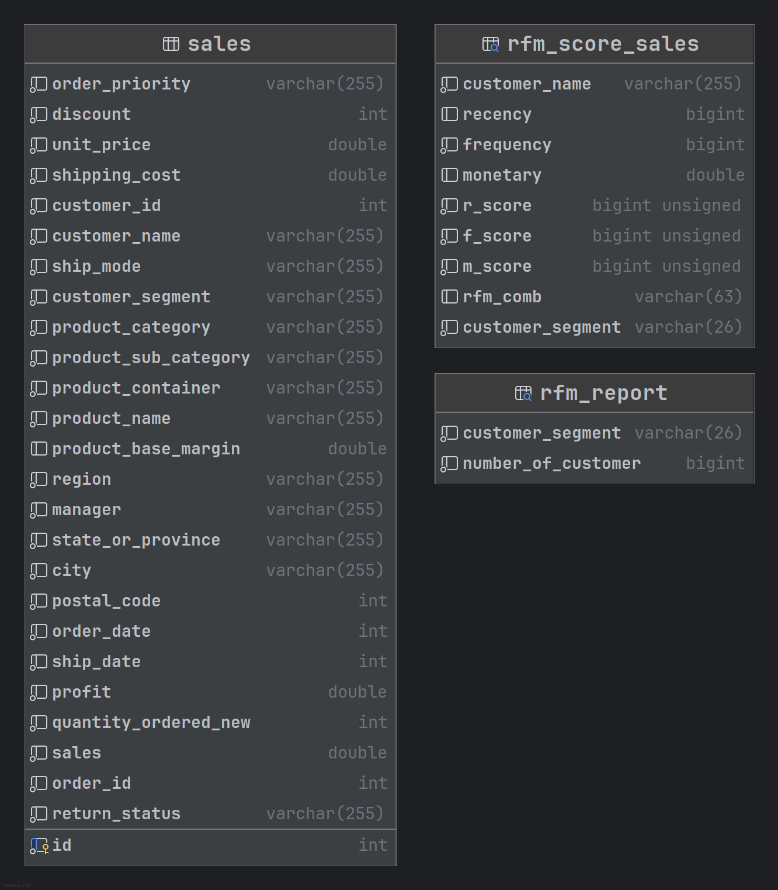
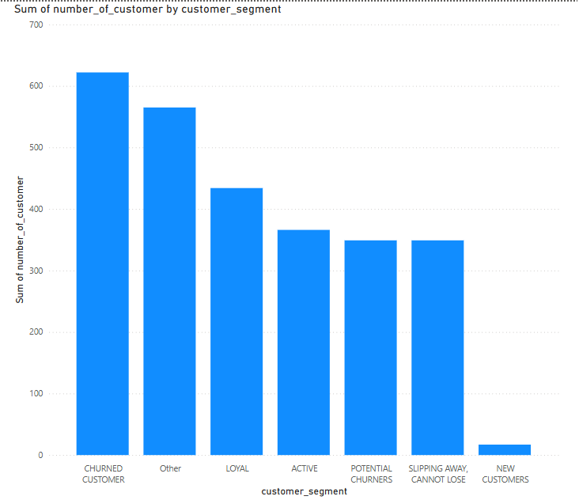

# 🌄 RFM Analysis


<div align="center">
  ✉️ Email: mail4tahsin@gmail.com <br>
  
  🔗 LinkedIn: [linkedin.com/in/tahsinayman](https://linkedin.com/in/tahsinayman) | 🐙 GitHub: [github.com/TahsinAyman](https://github.com/TahsinAyman)
  
</div>

---

- [Overview](#-overview)
- [Tools Used](#-tools-used)
- [Files](#️-files)
- [How to Run](#how-to-run-)
- [Table Structure](#-table-structure)
- [End Result](#-end-result)


## 🚀 Overview

This project involves customer segmentation using RFM `(Recency Frequency Monetary)` Segmentation in `SQL`

## 💼 Tools Used


### 🛰️ Files

- [`data.csv`](./data/data.csv) - used as primary source of data in table (used bulk insertion)
- [`table.sql`](./src/table.sql) - used to create database and tables necessary
- [`eda.sql`](./src/eda.sql) - used for exploratory data analysis
- [`rfm_segmentation.sql`](./src/rfm_segmentation.sql) - used to create view with RFM Segmented customer and their rfm score
- [`rfm_report.sql`](./src/rfm_report.sql) - used to create rfm report where the amount of customer of each category queried.
- [`main.sql`](./src/main.sql) - used to run operations

### How to Run 👈
- Clone the repository using 
    ```bash
    git clone https://github.com/TahsinAyman/supermarket_rfm_analysis.git
    ```
- Under a stable `MySQL` connection run [`table.sql`](./src/table.sql)
- From [`data.csv`](./data/data.csv) file import all the data using `MySQL Workbench` or `Data grip`
- To get a grasp of the data run [`eda.sql`](./src/eda.sql) (Optional)
- Run [`rfm_segmentation.sql`](./src/rfm_segmentation.sql) and [`rfm_report.sql`](./src/rfm_report.sql) sequentially.
- Run the [`main.sql`](./src/main.sql) to see report or the `RFM` score

### 🔥 Table Structure


### 🔥 End Result
